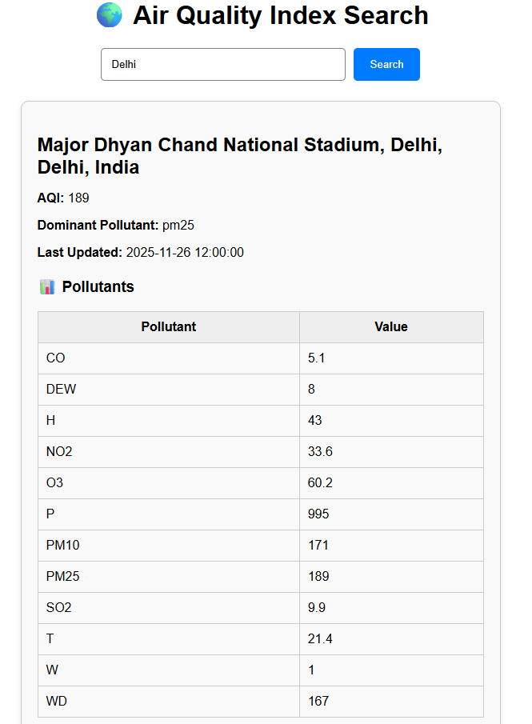

# Aqiprojectfinfactor
## 🛠️ Tech Stack

### **Frontend**
- React.js  
- Axios  
- HTML + CSS  
- JavaScript  

### **Backend**
- Node.js  
- Express.js  
- Axios  
- dotenv for environment variables  


>>>>>>>>>>>>>>>>>>>>>>>>>>>>>>>>>>>>>>>

## 🔧 Setup and Installation

### 1️⃣ **Clone the Repository**
```bash
git clone https://github.com/Dubeyvaishali001/Aqiprojectfinfactor.git
cd aqifinfactor


🖥️ Backend Setup (Node.js)
Install dependencies
cd backend
npm install

AQICN_TOKEN=your_api_token_here
API_URL=https://api.waqi.info/feed
PORT=5000


Start backend
npm start


Backend runs at:

http://localhost:5000


🎨 Frontend Setup (React)
Install dependencies
cd ../frontend
npm install

Start frontend
npm start


Frontend runs at:

http://localhost:3000


## 📸 Screenshots

## 📸 Screenshots

### 🏠 Homepage


### 🔍 AQI Result



🤝 Contributing

Contributions, issues, and feature requests are welcome!

📜 License

This project is licensed under the MIT License.

👤 Author
Vaishali Dubey

💼 MCA Student | Developer

🌐 https://dubeyvaishali001.github.io/dubey-portfolio/

✉️ Contact: vaishalidubeyofficial@gmail.com

